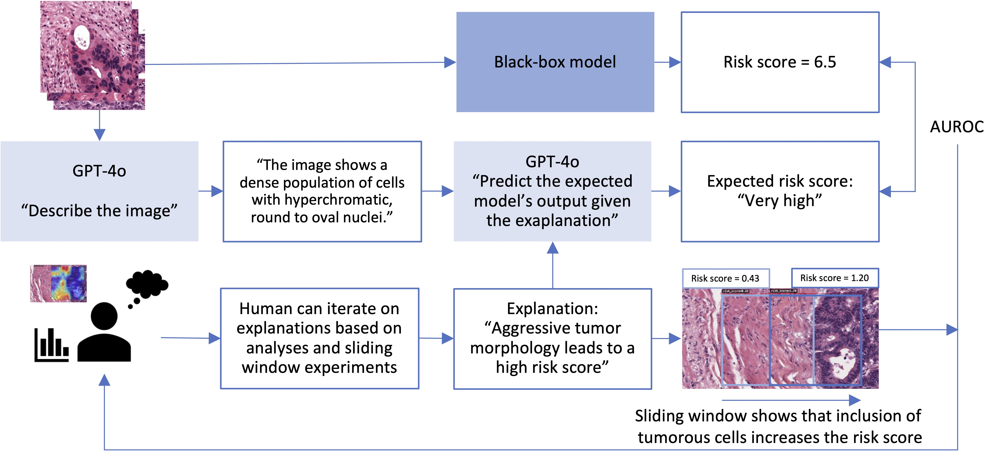

# X2X: From Explainable AI to Explained AI

This is the official code repository for the paper [**From Explainable to Explained AI: Ideas for Falsifying and Quantifying Explanations**](https://arxiv.org/pdf/2508.09205).

This repository contains tools for interactive analysis of AI model behavior, combining visual inspection with LLM-powered explanation quantification. The project consists of two main components: a viewer for interacting with MIL (Multiple Instance Learning) models and OpenAI-powered classification of images provided the conjectured explanation of the model.



## Project Structure

Below is a high-level overview of the project with the most important files and directories.

```
x2x/
├── config/
│   └── *.cfg        # Configure paths, device settings
├── model_weights/   # Pre-trained model weights (download separately)
├── prompts/
│   └── */*.cfg      # Explanations, image description, classification
├── tools/
│   ├── evaluate_explanation.py            # Test explanations with OpenAI
│   ├── analyze_explanation_evaluation.py  # Generate AUROC tables
│   └── run_x2x_viewer.py                  # Run the viewer
└── x2x/
    ├── viewer/
    │   └── *.py *.html *.js *.css   # WSI viewer application
    └── oai/
        └── oai_utils.py             # OpenAI API integration
```

## Installation

In the repository root directory, run:
```bash
conda create -n x2x python=3.10
conda activate x2x
python -m pip install -e .
git clone https://github.com/getspams/spams-python
cd spams-python && python -m pip install . && cd .. && rm -rf spams-python
```

## Components

### Viewer
The viewer component allows interactive exploration of AI model behavior:
- View whole slide images with deep zoom capability
- Select patches for model inference
- Visualize attention logit, score logit, normalized input image, and various GradCAM images
- Perform soft interventional experiments by comparing overlapping patches; a good explanation should be able to predict how the score changes as we include/exclude certain morphological features.

In order to use the viewer, the viewer requires 1) WSIs, and 2) model weights for model inference.
- WSIs may be downloaded from `https://portal.gdc.cancer.gov/`, but any others can be used. The current model is built for CRC.
- CRC prognostics model is downloaded from [https://github.com/KatherLab/crc-models-2022](https://github.com/KatherLab/crc-models-2022)
- RetCCL is downloaded from [https://github.com/Xiyue-Wang/RetCCL/](https://github.com/Xiyue-Wang/RetCCL/) -> [https://drive.google.com/drive/folders/1AhstAFVqtTqxeS9WlBpU41BV08LYFUnL](https://drive.google.com/drive/folders/1AhstAFVqtTqxeS9WlBpU41BV08LYFUnL) (last accessed on 31 March 2023)
- Adjust any paths or settings necessary in `viewer.cfg`.

To start the viewer, run:

```bash
python deepzoom_multiserver.py /path/to/directory/containing/wsis --port 1234 --config /path/to/x2x/config/viewer.cfg --log_dir /path/to/x2x/logs/viewer_output
```

View the WSIs in your browser at `http://localhost:1234/`. 

<details>
<summary>Detailed usage instructions:</summary>

- At http://localhost:1234/ you can select a WSI to view
- On the WSI viewer, you can pan and zoom to look through the WSI, which is based on the openslide/deepoom example which uses openseadragon
- At your cursor you will see a box with x-y coordinates at the set MPP
- Pressing `c` will run inference on the patch in the box under your cursor. This will show the predicted attention and score logits. Additionally, GradCAM images and the Macenko normalized image are shown on the location of the patch, which will show on hover. To select which image is shown on-hover, press the radio button on the left side of the screen, or use the `1-6` keys to toggle between them.
- Pressing `b` will run inference on three vertically overlapping patches.
- All images, gradcams, macenko normalized images, and their accompanying metadata like the x-y coordinates,mpp, score and attention logits are saved to the `/path/to/x2x/logs/viewer_output` directory, unless otherwise specified. This directory structure is used by the evaluation script.
</details>

<details>
<summary>Recommended use cases of the tool:</summary>

The tool can be useful for both targeted testing (testing an existing explanation) or exploration (exploratively understanding what the model does to generate an initial explanation).

Our recommended way to use the tool is to start off with a proposed explanation of what the model does. A part of this explanation may then be challenged by finding a region in the WSI that has a gradient of morphological features that are related to the explanation. The explanation _should_ be able to predict the change in the score logit as other morphological features are included. For example, an explanation may state that an immune response reduces the risk score provided by the model. The output score logit _should_ then decrease as we overlap patches that include more and more lymphocytes. Additional information may be provided by the GradCAM images; is the model indeed focusing on the explanation's proposed morphology for high/low scores?

During this investigation we observed some exploratory unexpected results. For example, healthy glands received a very high risk score, and some overlapping patches would have diverging scores (highly positive versus highly negative). The latter appeared to be caused by the Macenko normalization (the actual input to the model), which sometimes disturbs the color distribution so much that the features in the image are unrecognizable.

If you have no initial formal explanation under test (likely, however, you have some idea of what the model might do), the interactive nature of the viewer can be used to explore the model's behavior by selecting patches that are related to the expected function of the model. This may provide quick and easy insights in the model's output behavior on varying morphologies.

</details>

### OpenAI explanation-based predictions

OpenAI GPT-4o is used to describe the content of images, and make a prediction of the score of the image based on the explanation.

Usage requires a valid OpenAI API key ([https://auth.openai.com/create-account](https://auth.openai.com/create-account)) saved in a file called `~/.openai`.

To evaluate the explanation on a dataset of patches that is extracted with the viewer, run:

```bash
python tools/evaluate_explanation.py --explanation /path/to/explanation.txt --image_dir /path/to/images --log_dir /path/to/log_dir 
```
from the root of the repository.

The target label (ground truth) is the output of the model under test (in this case, the CRC risk classifier). The current set-up for explanation evaluation depends on the output structure of the viewer. Adjustments are required if you are interested in using it on other datasets with the output of other models.

This generates a `results.md` file in the stated logs directory. Find an example in [static/example_output.md](static/example_output.md).


## Run analysis of explanation evaluation

Generate the AUROC table for the OpenAI predictions compared to the actual model output. Provide the `input_dir` to be the directory containing all timestamped directories with the output of each explanation, and the script will take all results and summarize them in one table.

```bash
python tools/analyze_explanation_evaluation.py --input_dir /path/to/logs/evaluate_explanation --log_dir /path/to/logs/analyze_explanation_evaluation
```

## License

This project is licensed under the GNU Lesser General Public License v2.1 or later (LGPL-2.1+) - see the [LICENSE](LICENSE) file for details.

The LGPL license allows you to use this library in both open source and proprietary projects, while ensuring that any modifications to the library itself remain open source.

## Note

This is research software provided as-is. While we strive for reliability, we make no guarantees about the software's fitness for any particular purpose.

## Citation

If you use this software, please cite: 


@software{x2x,
  author = {Schirris, Y},
  month = {8},
  title = {{X2X: From Explainable to Explained AI}},
  url = {https://github.com/nki-ai/x2x},
  version = {1.0.0},
  year = {2025}
}

or the following plan bibliography:

`Schirris, Y. (2025). X2X: From Explainable to Explained AI (Version 1.0.0) [Computer software]. https://github.com/nki-ai/x2x`


