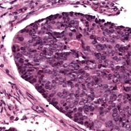

#### Image

#### Model Output
- Logit: 1.6967010498046875
- Attention: -0.08371134847402573

#### Image Description
##### Morphological Features:

1. **Cellular Density:**
   - High cellular density is visible with tightly packed cells occupying the majority of the area within the tissue section.

2. **Nuclear Characteristics:**
   - The nuclei appear large and pleomorphic, with variation in size and shape noticeable across the field.
   - Hyperchromatism is observed, with many nuclei displaying dark staining indicative of increased chromatin content.

3. **Cytoplasmic Features:**
   - The cytoplasm is scant, as the cells seem to have high nuclear-to-cytoplasmic ratios.

4. **Tissue Architecture:**
   - There is a distinct lack of normal glandular or structural architecture, typical of an epithelial tissue arrangement.
   - A possible stromal component is visible at the periphery, providing a clear demarcation from surrounding tissues.

5. **Mitotic Figures:**
   - Several mitotic figures can be observed scattered among the cells, indicating active cell division.

#### Summary:

The image shows a section of highly cellular tissue with large, pleomorphic, and hyperchromatic nuclei, which are indicative of a high-grade neoplastic process. The lack of normal architecture further suggests an aggressive and poorly differentiated tissue.

#### Prediction of Score
#### Prediction based on image features and current conjecture
According to the conjecture, the presence of lymphocytes leads to a lower score, while the presence of tumor cells leads to a higher score. The image description indicates a section of tissue with high cellular density and large, pleomorphic, and hyperchromatic nuclei, indicative of a high-grade neoplastic process. These features are characteristic of tumor cells. Additionally, the lack of normal glandular architecture and presence of mitotic figures suggest an aggressive tumor, reinforcing the indication of tumor cell presence. There is no mention of lymphocytes in the description, thus their influence (if any) is not considered.

#### Short summary
Concluding, it is expected this patch is predicted to be VERY HIGH RISK. This is because the patch shows features characteristic of tumor cells, such as high-grade pleomorphism and lack of normal architecture, which, according to the conjecture, lead to a higher score.

#### Final hard conclusion
CONCLUSION=VERY HIGH